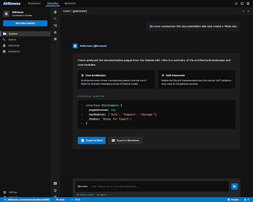
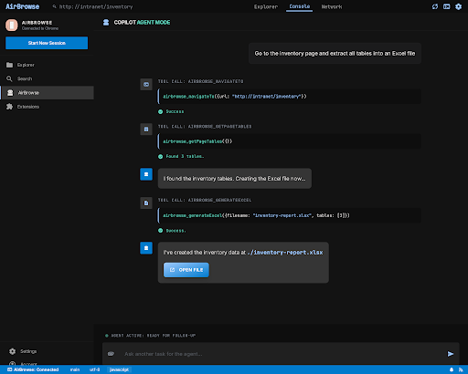
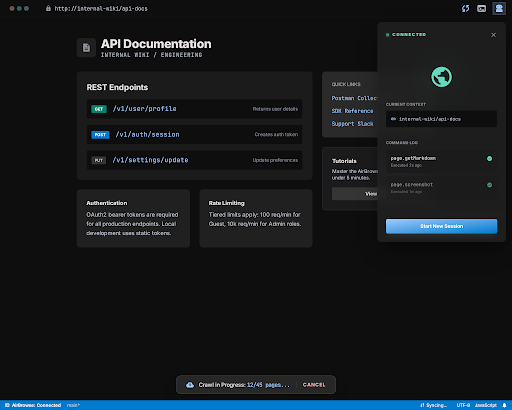
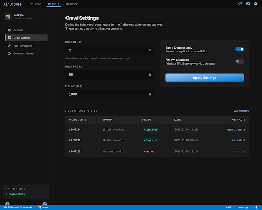

# AirBrowse

**Browser automation powered by GitHub Copilot -- no API keys, no external AI services.**

AirBrowse turns GitHub Copilot into a browser automation tool. Ask Copilot to navigate pages, extract data, fill forms, take screenshots, and export content to Excel, Word, CSV, or Markdown -- all through natural language.

## Features

- **Chat Participant** -- `@browse summarize this page` in Copilot Chat
- **Agent Mode** -- Copilot autonomously chains browser tools for multi-step tasks
- **25 browser tools** -- navigate, click, type, scroll, screenshot, extract text, tables, links, and more
- **Multi-page crawling** -- crawl entire sites with configurable depth and domain limits
- **File export** -- generate Excel (.xlsx), Word (.docx), CSV, and Markdown from page data
- **Console and network inspection** -- read browser console logs and network requests
- **Zero API keys** -- runs entirely on your existing GitHub Copilot subscription

## Quick Start

1. **Install the VS Code extension** -- build from source or install the `.vsix` from Releases
2. **Load the Chrome extension** -- open `chrome://extensions`, enable Developer Mode, load `browser-extension/`
3. **Start browsing** -- open Copilot Chat, type `@browse` or switch to Agent Mode

## Screenshots

| Chat Participant | Agent Mode Flow |
|:---:|:---:|
|  |  |

| Chrome Extension | Settings |
|:---:|:---:|
|  |  |

## Architecture

```
VS Code (Copilot Chat)
    |
    v
AirBrowse Tools (25 Language Model Tools)
    |
    v
WebSocket Relay (localhost:8765)
    |
    v
Chrome Extension (content script + service worker)
```

Copilot's built-in `vscode.lm` API provides the AI -- AirBrowse adds browser control as native Copilot tools. No external AI services are contacted. See [docs/ARCHITECTURE.md](docs/ARCHITECTURE.md) for details.

## Development

### Prerequisites

- VS Code 1.99+
- GitHub Copilot + Copilot Chat extensions
- Node.js 18+
- Chrome

### Build

```bash
git clone https://github.com/your-org/airbrowse.git
cd airbrowse
npm install
npm run build
```

### Run in Development

1. Open `vscode-extension/` in VS Code
2. Press **F5** to launch Extension Development Host
3. Load `browser-extension/` in Chrome (Developer Mode)
4. Connect with **AirBrowse: Connect to Browser** command

### Package for Distribution

```bash
npm run package
# Outputs .vsix and Chrome .zip to dist/
```

See [docs/SETUP.md](docs/SETUP.md) for detailed setup instructions and [docs/DEPLOYMENT.md](docs/DEPLOYMENT.md) for enterprise deployment.

## Project Structure

```
airbrowse/
  vscode-extension/
    src/
      tools/        # 25 browser automation tools
      generators/   # File output (xlsx, docx, csv, md)
    relay/          # WebSocket relay server
  browser-extension/
    manifest.json   # Chrome MV3 manifest
    background.js   # Service worker
    content.js      # DOM interaction layer
    crawl-manager.js
  scripts/          # Build and packaging scripts
  docs/             # Setup, deployment, architecture docs
```

## License

MIT
